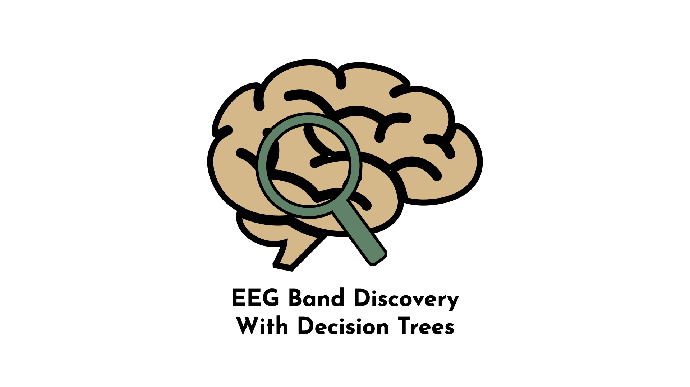

# 🎯 Data Scientist

#### **Technical Skills:** Python · SQL · AWS · Snowflake · MATLAB

---

## 🎓 Education
- **Ph.D., Physics** — University of Arcadia (_May 2022_)  
- **M.S., Physics** — University of Arcadia (_Dec 2019_)  
- **B.S., Physics** — University of Arcadia (_May 2017_)

---

## 💼 Work Experience

### **Data Scientist @ Orion Analytics**  
📅 _June 2022 – Present_  
- Discovered and fixed a critical step missing from the production pipeline, improving data integrity for 80% of records.  
- Rebuilt the loan origination risk model, boosting performance by 45% and preventing significant financial losses.

### **Data Science Consultant @ Insight Labs**  
📅 _Jan 2021 – May 2022_  
- Processed and analyzed biometric data from over 300 variables to study performance under stress conditions.  
- Applied unsupervised deep learning to ICU data, revealing new sub-phenotypes in sepsis progression.

---

## 🧠 Projects

### 🔍 Data-Driven EEG Band Discovery
📄 [Publication Link](#)  
Developed a **Python-based approach** for automatically discovering optimal EEG frequency bands.  
The model doubled performance compared to traditional boundaries, allowing improved brain-signal interpretation.

---

### 🚴 Air Quality & Cognitive Load Estimation
📄 [Publication Link](#)  
Used **MATLAB** to train 100+ ML models predicting particulate matter concentrations from biometric features.  
Results achieved **R² = 0.91**, showing smaller particles correlate strongly with measurable physiological responses.

---

## 🎤 Talks & Lectures
- *Causality: The New Science of an Old Question* — Research Seminar (2021)  
- *Dimensionality Reduction for Scientific Discovery* — Guest Lecture (2020)  
- *Fourier & Wavelet Transforms* — Guest Lecture (2019)  
- *Introduction to Optimization* — Seminar (2019)

🎥 [YouTube Channel](https://youtube.com)

---

## 📝 Publications
1. Doe, J. et al. *Modeling Autonomic Pupillary Responses Using ML*. (2022)  
2. Doe, J. et al. *Machine Learning for Sensor Calibration*. *Sensors*, 2021.  
3. Doe, J. *Autonomous Learning with Robotic Sensing*. *Sensors*, 2021.  
4. Doe, J. *Light Sensor Calibration via ML*. *Sensors*, 2021.  
5. Doe, J. *EEG Band Discovery with Decision Trees*. *Preprint*, 2022.  
6. Doe, J. *Unsupervised Blink Detection*. *Preprint*, 2022.  
7. Doe, J. *Environmental Health Insights via Big Data*. *Springer*, 2022.

📰 [Data Science Blog](https://medium.com)

---

## 🌐 Links
- [GitHub](https://github.com/yourusername)  
- [LinkedIn](https://linkedin.com/in/yourusername)  
- [Google Scholar](https://scholar.google.com)  
- [Email](mailto:your.email@example.com)
